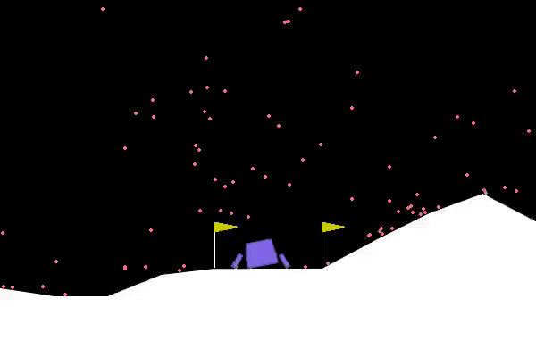

# RLforDummy: Reinforcement Learning Algorithms Implementation

  
  

## Project Overview
This project is a collection of my implementations of several key Reinforcement Learning (RL) algorithms. It serves as a practical exploration into the field of RL and demonstrates the application of these algorithms in solving complex environments. 

## Implemented Algorithms
In this repository, you will find my implementations of the following algorithms:

1. **Semi-RainbowDQN**: An adaptation of the Rainbow DQN algorithm that incorporates several, but not all, enhancements over the standard DQN.
   - Reference: M. Hessel et al., "Rainbow: Combining Improvements in Deep Reinforcement Learning," in AAAI Conference on Artificial Intelligence, 2018. [Link](https://arxiv.org/abs/1710.02298)

2. **Advantage Actor-Critic (A2C)**: This algorithm combines the benefits of value-based and policy-based RL, using an actor-critic approach.
   - Reference: V. Mnih et al., "Asynchronous Methods for Deep Reinforcement Learning," in International Conference on Machine Learning, 2016. [Link](https://arxiv.org/abs/1602.01783)

3. **Proximal Policy Optimization (PPO)**: PPO is an on-policy algorithm that optimizes a clipped surrogate objective function to balance exploration and exploitation. It has achieved state-of-the-art results on both Atari and Mujoco environments.
   - Reference: J. Schulman et al., "Proximal Policy Optimization Algorithms," arXiv preprint arXiv:1707.06347, 2017. [Link](https://arxiv.org/abs/1707.06347)

## Solved Environment
Each of the implemented algorithms has been sanity-tested on 'CartPole-v1' and 'LunarLander-v2' environments from OpenAI Gym. All algorithms solved the two toy environments under various hyperparameters and runtimes. PPO has been tested on Atari and Mujoco where it achieved benchmark results
